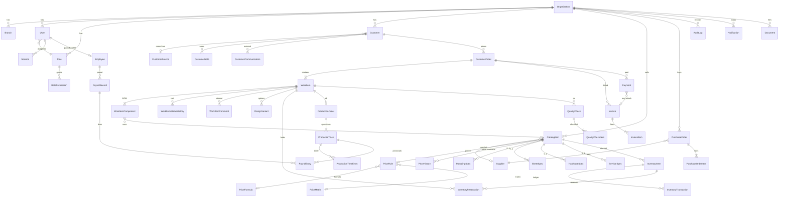

# FrameWorkshop ERP — entity relationship overview

Money fields are integer kopecks. Dimensions are integer millimetres.
Quantities are floats rounded to 4 decimals. Every business table includes
`organizationId` (omitted on the diagram for readability).

## Cardinality notes

- One `CustomerOrder` holds many `WorkItem`s (a client may drop off three
  pieces in one visit).
- Components are generic: two mouldings are two rows, not `frame1`/`frame2`.
- `InventoryReservation` links a work item to a stock row. Status is `ACTIVE`,
  `RELEASED` or `CONSUMED`.
- `Payment.kind` is `PAYMENT` or `REFUND`; rows are voided, not deleted.
- Photos hang off `(entityType, entityId)` so intake and finished shots share
  one table without a forest of foreign keys.

## Status sets (independent)

| Entity | Tracks |
| --- | --- |
| `CustomerOrder.commercialStatus` | CALCULATION → QUOTE → CONFIRMED / CANCELLED |
| `CustomerOrder.productionStatus` | WAITING / IN_PRODUCTION / READY / ISSUED (derived) |
| `CustomerOrder.paymentStatus` | UNPAID / PARTIAL / PAID / REFUNDED |
| `WorkItem.status` | DRAFT … READY / ISSUED / CLOSED / CANCELLED |
| `ProductionOrder.stage` | kanban column (CUTTING, ASSEMBLY, …) |

Production status on the parent order is derived from its pieces
(`deriveOrderProductionStatus`) whenever a piece moves.
